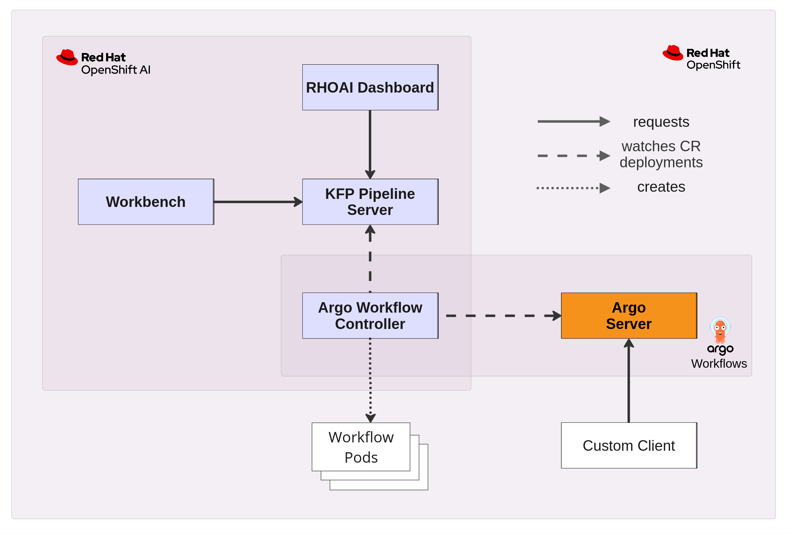
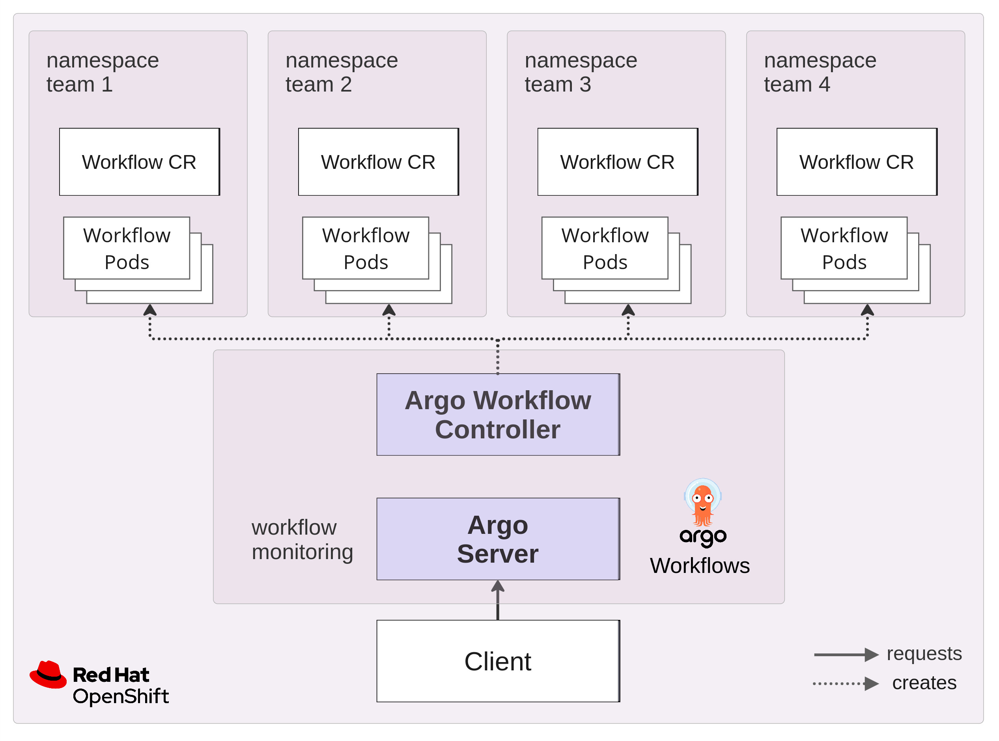
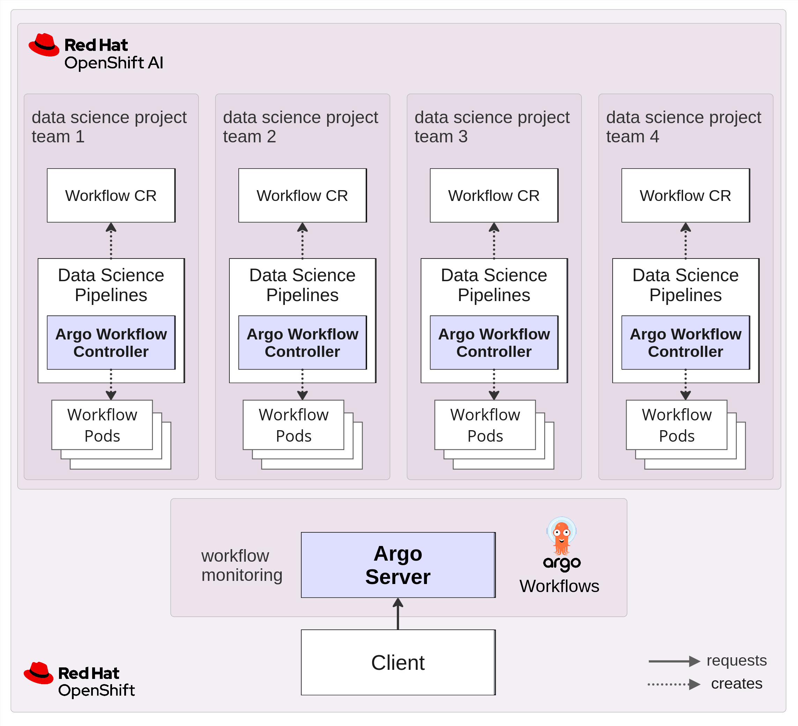

# Argo Workflows and OpenShift AI: A Proof of Concept

This repository contains the assets to reproduce the Proof of Concept validating the feasibility of integrating an existing Argo Workflows installation with OpenShift AI.

## Architecture

The following diagram illustrates the high-level architecture of the PoC:
- Argo Workflows is deployed onto an OpenShift cluster (bottom right half). Argo Workflows consists of
    - the (upstream) _Argo Workflow Controller_, which is the backend engine creating pods based on the `Workflow` custom resource (CR), and
    - the _Argo Server_, which is the frontend hosting the GUI and workflow orchestration and persistence services. The Argo Server may be consumed by a client through its REST endpoint or a Python client.
- OpenShift AI is deployed into the same environment (top left half). The components of interest for this PoC are:
    - the OpenShift AI-native Argo Workflow Controller, which is completely managed by OpenShift AI,
    - the _Kubeflow Pipelines Server_ (KFP Pipeline Server), which orchestrates pipelines in the KFP format and translates them into `Workflow` CRs,
    - the _OpenShift AI Dashboard_ (RHOAI Dashboard) as the OpenShift AI-native UI through which pipelines can be uploaded and scheduled,
    - a _Workbench_, which is a containerized IDE instance for submitting pipelines programmatically.

The goal of the PoC was to validate the feasibility of replacing the default Argo Workflow Controller by the one shipped with OpenShift AI.

## Setup

The Proof of Concept was implemented in an Azure Red Hat OpenShift environment with the following components:
- OpenShift 4.13.44
- OpenShift AI 2.12.0
- Argo Workflows 3.5.6

OpenShift AI includes the workflow controller of Argo Workflows, which is used as a backend engine for Data Science Pipelines. As of OpenShift AI 2.12.0, this workflow controller corresponds to Argo Workflows 3.3.10.

### Installation

#### Argo Workflows

Within the running OpenShift environment, as a cluster admin user deploy Argo Workflows via ([installation details](https://github.com/argoproj/argo-helm/tree/argo-workflows-0.41.4/charts/argo-workflows)):

`helm install argo-workflows argo/argo-workflows --version 0.41.4`

Create a separate namespace `argo-test` for testing workflow deployment. Set up the necessary RBAC using `/poc/argo-workflows/rbac.yaml`.

To validate the deployment, access the Argo Workflows UI. It can be accessed through the `argo-ui` route URL. For authentication, find the server's token within the `argo-workflows-server-token-xxx` secret. Log in with token authentication using `Bearer [token]` as the authentication token.

#### OpenShift AI

Install the _Red Hat OpenShift AI_ operator through the Operator Hub, using the `fast` subscription channel.

> :bulb: **GitOps:** Deploy the `/poc/rhoai/operator.yaml` manifest.

OpenShift AI 2.12.0 fails to install if Argo Workflows has already been installed on the cluster (the Workflows CRD is already present). Before proceeding, find and delete the `workflows.argoproj.io` CRD:

`oc delete crd/workflows.argoproj.io`

> :warning: **Warning:** This is a destructive action. All existing `Workflows` CRs on the cluster will be removed by this. Make sure to backup all needed CRs before deleting the CRD.

Instantiate a minimal installation of OpenShift AI dy deploying `/poc/rhoai/datasciencecluster.yaml`.

To satisfy the dependency on an S3-compliant object storage provider, deploy a small-scale Minio instance in a separate namespace, see `/poc/rhoai/minio.yaml`.

Through the OpenShift AI dashboard create a new Data Science Project `rhoai-test` and configure and instantiate a pipeline server ([details](https://docs.redhat.com/en/documentation/red_hat_openshift_ai_self-managed/2.12/html/working_with_data_science_pipelines/managing-data-science-pipelines_ds-pipelines#configuring-a-pipeline-server_ds-pipelines)). This triggers the deployment of the namespace-scoped Argo Workflow controller that is integrated in OpenShift AI.

> :bulb: **GitOps:** Deploy the `/poc/rhoai/datasciencepipelineapplication.yaml` manifest.

## Test workflow

We're using the following steps to verify that the Argo Workflow Controller works as expected.

### Step 1: Workflow template deployment

Deploy the test templates under `/poc/test-samples/workflow-templates.yaml` into the `argo-test` namespace.

Verify the deployment by finding these templates in the Argo Workflows UI (navigate to Workflow Templates and select as Namespace `argo-test`).

### Step 2: Workflow deployment

Deploy the test workflow under `/poc/test-samples/workflows.yaml` into the `argo-test` namespace.

Verify the deployment by finding this workflow in the Argo Workflows UI (navigate to Workflows and select as Namespace `argo-test`).

### Step 3: Workflow trigger through REST API

The final step is to trigger execution of the test workflow through the [REST API of Argo Server](https://argo-workflows.readthedocs.io/en/latest/swagger/).

`/poc/test-samples/test-requests.ipynb` is a Jupyter notebook that can be used to interactively query the Argo Server through the REST API. Enter the following parameters into the notebook before executing it:
- `argo_server_endpoint`: the service endpoint URL including protocol and port,
- `auth_token`: the authentication token obtained from the Argo Server service account (see _Installation_ -> _Argo Workflows_),
- `workflow_namespace`: the namespace in which the workflow CR has been deployed,
- `test_workflow_name`: the generated name of the deployed workflow.

Executing the cells will validate that the REST API can be consumed and will provide server details based on the query. The final cell will trigger execution of the test workflow, which can be verified within the Argo Workflows UI.

## Verified scenarios

Using the test workflow outlined above, we verified the following scenarios.

### Default scenario: default Argo Workflows deployment

We ran the test workflow after deploying Argo Workflows and verified the correct deployment.

### Default scenario: Native OpenShift AI workflows

We deactivated the upstream Argo Workflow Controller (scaling its deployment to zero) and deployed a workflow through Elyra Pipelines as a regular workflow in OpenShift AI. The namespace-scoped Workflow Controller in OpenShift AI generated the resulting workflow pods, which could be monitored in the Argo Workflows UI.

If the upstream Argo Workflows Controller is re-activated, spurious errors occured during workflow execution, which are cause by two controller instances acting on the same workflow CRs.

### Integration scenario 1: drop-in replacement of upstream controller with the one from OpenShift AI

In this scenario, we replaced the upstream Argo Workflow Controller by the one shipped with OpenShift AI, removing the `--namespaced` execution argument. The resulting deployment manifest is located under `/poc/rhoai/controller-global.yaml`.

We validated this scenario by successfully executing the test workflow.

### Integration scenario 2: deploying the namespace-scoped controller from OpenShift AI

To reproduce the behavior of the Argo Workflow Controller within OpenShift AI, we deactivated the global controller instances and copied the controller deployment from within OpenShift AI to the test workflow namespace, see `/poc/rhoai/controller-namespaced.yaml`.

We validated this scenario by successfully executing the test workflow.

### Integration scenario 3: deploying Data Science Pipelines into workflow namespaces

Based on the assumption that workflows are already executed via the upstream controller within a given number of namespaces, we explored whether these namespaces can be managed as Data Science Projects with the OpenShift AI-native controller shipped and managed by the Data Science Pipelines application. For this we deactivated the global and existing namespace-scoped controller instances within the test workflow namespace and deployed Data Science Pipelines into this namespace through the OpenShift AI Dashboard (see `Installation` -> `OpenShift AI`). This leads to the deployment of the OpenShift AI-native controller as well as the necessary RBAC rules for the controller service account.

We validated this scenario by successfully executing the test workflow.

## Conclusion

In the scope of this Proof of Concept, we explored and validated the integration of upstream Argo Workflows and the Argo Workflow Controller shipped with OpenShift AI. Overall, the OpenShift AI-native workflow controller exhibited identical behavior as the upstream one, which allows for multiple implementations of a technical integration:
- Argo Workflows-native approach by drop-in replacement of the global upstream controller by the one from OpenShift AI (integration scenario 1),
- hybrid approach through namespace-scoped deployments of the OpenShift AI-native controller (integration scenario 2),
- OpenShift AI-native approach by having controller instances fully managed by OpenShift AI through deploying Data Science Pipelines within the respective execution namespaces (integration scenario 3).

All of these scenarios are technically feasible as confirmed by this Proof of Concept. For enhanced multi-tenancy and reduced administration, the OpenShift AI-native integration is recommended as discussed below.

### Original architecture

In the original architecture (see below) a standard deployment of Argo Workflows consisting of a single Argo Server and Argo Workflow Controller instance is monitoring and acting on all workflows across all namespaces by default.

The pros and cons of this architecture can be summarized as follows.

| Pros | Cons |
| ---- | ---- |
| easy to set up through default Helm deployment | need to set up RBAC in execution namespaces |
| minimal resource consumption of Argo Workflows | single controller instance is bottleneck / single point of failure |

### OpenShift AI-native integration (scenario 3)

Integration scenario 3 removes the original Argo Workflow Controller by namespace-scoped controllers that are fully managed by OpenShift AI. No additional configurations are needed, neither on the side of upstream Argo Workflows nor on the side of OpenShift AI. OpenShift AI automates and manages the following aspects of the workflow controller for each designated namespace:
- deployment,
- RBAC,
- updates.

The pros and cons of this architecture can be summarized as follows.

| Pros | Cons |
| ---- | ---- |
| automated set up through OpenShift AI, incl. RBAC | resource overhead of additional OpenShift AI application components1 |
| easy to maintain due to automated upgrades | additional S3 object storage dependency2 |
| enhanced multi-tenancy by separating controller instances by namespace | |

Notes:
1. Each namespace with Data Science Pipelines hosts seven application pods (including the workflow controller) with a total resource request of about 1.3 CPU and 3.3 GB RAM, see Appendix 1. As described in Appendix 1, the application deployments can be pruned to achieve a total resource request of about 0.4 CPU and 1.2 GB RAM. Subtracting the resource footprint of the workflow controller, we arrive at an unused resource overhead of about 0.3 CPU and 768 MB RAM. A workaround for completely removing the resource overhead is described in Appendix 3.
2. S3-compliant object storage is a dependency of Data Science Pipelines, for which various object storage solutions like AWS S3 or self-managed options such as Ceph S3, or Minio can be used. This object storage is used for storing artifacts produced by OpenShift AI-native pipelines. If the workflow controller within Data Science Pipelines is used directly, artifact tracking is skipped and the S3 storage provider is not consuming resources above its baseline.

## Appendix

### 1. Data Science Pipelines resource footprint

#### Full deployment

OpenShift AI features Data Science Pipelines, a pipeline orchestration engine with a multi-tenant architecture based on namespace isolation. Each namespace in which Data Science Pipelines is enabled contains the following application components:

| Name | CPU request | Memory request in MB |
| ---- | ----------- | -------------------- |
| Workflow controller | 0.12 | 500 |
| KFP pipeline server | 0.35 | 756 |
| Metadata envoy service | 0.2 | 512 |
| Metadata gRPC service | 0.1 | 256 |
| Persistence agent | 0.12 | 500 |
| Workflow scheduler | 0.12 | 100 |
| Maria DB | 0.3 | 800 |
| **Total** | **1.31** | **3424** |

#### Minimal deployment

Once deployed, the Data Science Pipelines CR can be customized to enable a minimal deployment, which renders the overall Data Science Pipelines application non-functional but preservers the workflow controller deployment. A sample manifest is given in `/poc/rhoai-datasciencepipelinesapplication-minimal.yaml`. Once the CR has been updated, the pipeline server, persistence agent, workflow scheduler, and Maria DB deployments can be removed to minimize the overall resource overhead:

| Name | CPU request | Memory request in MB |
| ---- | ----------- | -------------------- |
| Workflow controller | 0.12 | 500 |
| Metadata envoy service | 0.2 | 512 |
| Metadata gRPC service | 0.1 | 256 |
| **Total** | **0.42** | **1268** |

#### Minimal stable deployment

In the previous minimal deployment, the metadata gRPC service remains in an error state as it fails to connect to its assigned Maria DB instance. To avoid running pods in an error state, we can allow the re-activate the deployment of Maria DB to achieve a small and stable set of Data Science Pipelines components. Find the corresponding manifest under `/poc/rhoai/datasciencepipelineapplication-small-stable.yaml`.

| Name | CPU request | Memory request in MB |
| ---- | ----------- | -------------------- |
| Workflow controller | 0.12 | 500 |
| Metadata envoy service | 0.2 | 512 |
| Metadata gRPC service | 0.1 | 256 |
| Maria DB | 0.3 | 800 |
| **Total** | **0.72** | **1868** |

Note that arbitrary application components can be fully shutdown by setting Data Science Pipelines applications unmanaged in the OpenShift AI instance, see Appendix 3.

### 2. Custom Resource Definitions

Compatibility between the upstream Argo Workflow Controller and the one from OpenShift AI critically depends on the specifications of the Custom Resources they act on, which are defined within their Custom Resource Definitions (CRDs). The CRDs of upstream Argo Workflows are collected in `/poc/argo-workflows/crds.yaml` while the corresponding one shipped with OpenShift AI can be found in `/poc/rhoai/crds.yaml`. A comparison of the respective `workflows.argoproj.io` CRDs reveals:
- no difference within the schema, i.e. the technical specification of the CR,
- an additional printer column `Message` ("Human readable message indicating details about why the workflow is in this condition.") within the upstream CRD, which can be considered outside of the technical specification for practical purposes.

With this, no incompatibilities between the different workflow controller versions are expected with respect to their supported Workflow Custom Resource specifications.

### 3. Full control over Data Science Pipelines application deployments

As highlighted in Appendix 1, the `DataSciencePipelinesApplication` CR can be customized to reduce the number of application components that are running in a given namespace. However, it is currently not possible to fully customize which components are running, e.g. only the workflow controller. The following steps can be followed as a workaround for fully controlling the running application components:
1. Deploy the Data Science Pipelines application in a given namespace (either through the dashboard or by deploying a `DataSciencePipelinesApplication` CR). Verify that its components are running (see Appendix 1).
2. Within the namespace `redhat-ods-applications`, find the deployment `data-science-pipelines-operator-controller-manager` (DSPOCM). Scale it down to 0. This renders all Data Science Pipelines instances on the cluster unmanaged.
3. Go back to the namespace in which you deployed the Data Science Pipelines application in step 1. You can now scale down or remove any unwanted pipelines application deployments to achieve your desired set of running components.

This approach comes with a number of limitations. Since the central DSPOCM manages the lifecycle of all Data Science Pipelines applications on the cluster, deactivating it will impact all lifecycle operations including creation and upgrades. Specifically, the DSPOCM needs to be running in the following cases:
- a new Data Science Pipelines application (including the workflow controller) should be installed in another namespace, 
- existing Data Science Pipelines application components (including the workflow controller) should be upgraded after upgrading the OpenShift AI installation.

In both cases, after re-activating the DSPOCM, the lifecycle operations of Data Science Pipelines will resume, which means that previously deactived pipelines application components will be re-deployed in the namespaces containing pipelines applications. Once all upgrades and new deployments have been implemented, you can restore your customized deployment layout by re-applying the workaround steps described above.